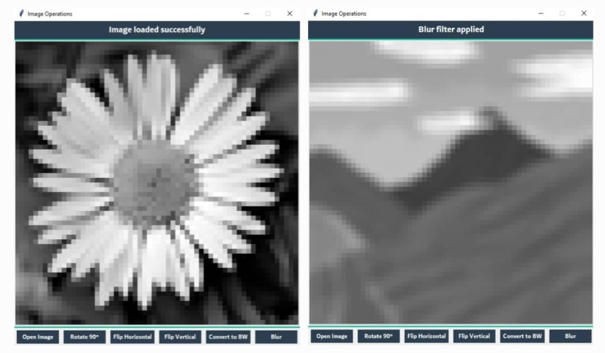

# 🚀 معالجة الصور! 🧩

في الواقع، الصورة تمثل مجموعة بكسلات مرتبة على شكل مصفوفة (Matrix). حتى نتمكن من معالجة الصور، علينا التلاعب بالمصفوفة.

هذا المشروع (repo) يحتوي على واجهة بسيطة تمكّننا من معالجة الصور بسهولة. حيث يأخذ الصورة، يحولها إلى صورة بتدرج رمادي، ويخزنها على شكل مصفوفة، ثم يعرضها في الواجهة الرسومية كبكسلات بلون رمادي. يتيح لك التعامل معها ومعالجتها من خلال الأزرار التالية:

1 **تدوير الصورة بزاوية 90 درجة**

2 **عكس الصورة:**
- عكس ترتيب الأعمدة في كل صف (أفقيًا).
- عكس ترتيب الصفوف بالكامل (عموديًا).

3 **تحويل الصورة إلى أبيض وأسود**

4 **تطبيق فلتر التمويه (Blur)**

---

💡 **إذا كانت لديك أفكار إبداعية أخرى لتعديل الصور باستخدام المصفوفات، شاركنا إياها!**  
الكود متاح للجميع، يمكنكم التعديل عليه وتطويره. 🌟
